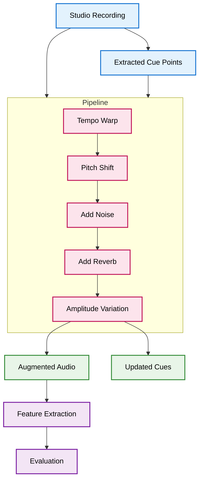

- perturbations are modular **pure** functions
- perturbations are collected as **first class members** in lists
	-> can be **passed** to composition-function ( **order of application** via dictionary or enum ) 
	-> modular pipeline important for ablation studies

## Order of perturbation application

1. any time-/warp-based perturbations
	else all other types of perturbations will also be stretched/compressed

2. any type of perturbation that is dependent on the audio file
	pitch shift, reverb/delay, eq, compression, dynamics (fade in/out, ..), 

3. all other that are independent
	noise, distortions, artifacts

## Dynamic Implementation per perturbation

- **tempo/timing** 
	-> section-based / cue-based

- **noise/ambient/crowd** 
	-> vary amplitude, panning, spectral content over time 
		volume relative to audio
		trigger on certain cues or sections ( -> crowd bursts )

- **Audio Effects/Acoustics** 
	-> mostly static, maybe slight variation

- **Volume/Amplitude** 
	-> Slow LFO / gaussian noise envelope

- **Pitch Shift** 
	-> very subtle micro fluctuation in some sections

#### Priority/Likelihood of Perturbations in real performances
Tempo/Timing **>>>** Noise/Crowd/Ambient **>>>** Volume/Amplitude **>>>** Pitch Drift **>>>** minor Distortions / Artifacts

